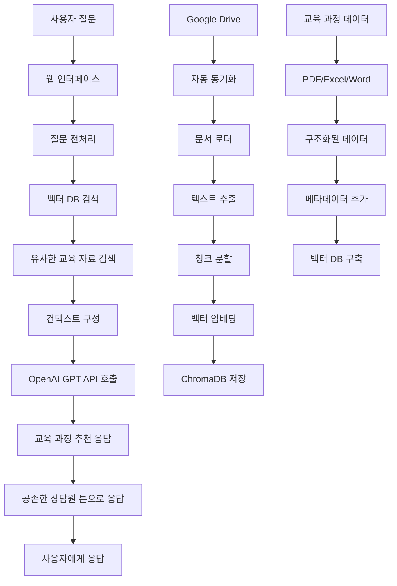

RAG 기반 챗봇 프로젝트

### 📝 프로젝트 개요

이 프로젝트는 RAG(Retrieval-Augmented Generation) 기술을 활용하여 정확하고 최신 정보를 제공하는 챗봇을 구축합니다. 미리 준비된 지식 문서에서 관련 정보를 검색하여, LLM(Large Language Model)이 답변을 생성하는 방식으로 동작합니다.

### ✨ 주요 기능

- **문서 기반 답변**: 사용자 질문에 대해 특정 문서에서 검색된 정보를 바탕으로 답변합니다.
- **환각(Hallucination) 감소**: LLM이 사실과 다른 내용을 생성하는 문제를 최소화합니다.
- **최신 정보 활용**: 모델 학습 시점 이후의 새로운 문서 내용을 반영할 수 있습니다.
- **출처 투명성**: 답변의 근거가 되는 문서 출처를 제공하여 신뢰성을 높입니다.

### 🛠️ 기술 스택

- **언어**: Python
- **프레임워크/라이브러리**: LangChain
- **임베딩 모델**: OpenAIEmbeddings
- **벡터 데이터베이스**: FAISS 또는 ChromaDB (선택 가능)
- **LLM**: OpenAI GPT 모델

### 🚀 설치 및 실행 방법

1.  **환경 설정**:

    ```bash
    git clone [레포지토리 URL]
    cd [레포지토리 이름]
    pip install -r requirements.txt
    ```

2.  **문서 준비**:
    `your_document.txt` 파일에 챗봇이 학습할 문서를 넣어주세요.

3.  **코드 실행**:
    ```bash
    python main.py
    ```

## 현재 진행 상황 분석

### ✅ 완료된 단계
1. **프로젝트 구조 설계 및 생성** - 완료
2. **기본 아키텍처 구현** - 완료
   - DocumentLoader (PDF, Excel, Word, CSV, TXT 지원)
   - DocumentEmbedder (ChromaDB 연동)
   - ChatbotSearch (OpenAI GPT 연동)
   - GoogleDriveSync (Google Drive API 연동)
3. **설정 파일 및 의존성 관리** - 완료

### 🎯 현재 단계
**Step 2: 데이터 수집 및 벡터 DB 구축 단계**

## 다음 진행해야 할 단계

### Step 2-1: Google Drive 연동 및 데이터 수집
1. **Google Drive API 설정**
   - Google Cloud Console에서 프로젝트 생성
   - Drive API 활성화
   - credentials.json 파일 다운로드
   - 환경 변수 설정

2. **데이터 자동 동기화 구현**
   - Google Drive 폴더 ID 설정
   - 자동 파일 다운로드 및 업데이트

### Step 2-2: 교육 데이터 특화 처리
1. **교육 과정 데이터 구조화**
   - 과정명, 커리큘럼, 수강료, 기간 등 메타데이터 추가
   - FAQ 데이터 정리

2. **챗봇 응답 최적화**
   - 교육 서비스 특화 프롬프트 작성
   - 공손한 상담원 톤 설정

### Step 3: 웹 인터페이스 개발
1. **Flask/FastAPI 기반 웹 서버**
2. **챗봇 UI 구현**
3. **실시간 대화 기능**

## 설계 흐름도



## 상세 아키텍처 흐름

### 1. 데이터 수집 및 처리 파이프라인
```
Google Drive → 자동 동기화 → 문서 로더 → 텍스트 추출 → 청크 분할 → 벡터 임베딩 → ChromaDB 저장
```

### 2. 챗봇 응답 파이프라인
```
사용자 질문 → 벡터 검색 → 관련 교육 자료 검색 → 컨텍스트 구성 → GPT API → 교육 과정 추천 응답
```

## 즉시 진행할 작업

### 1. Google Drive API 설정
