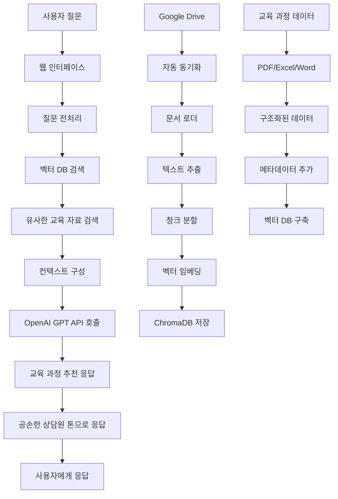

# LLM Chatbot - 문서 기반 챗봇

문서(PDF, Word, Excel 등)를 업로드하고 벡터 데이터베이스에 저장한 후, 해당 문서 내용을 기반으로 질문에 답변하는 LLM 챗봇입니다.

## 주요 기능

- **다양한 문서 형식 지원**: PDF, Word, Excel, CSV, TXT 파일 지원
- **벡터 데이터베이스**: ChromaDB를 사용한 효율적인 문서 검색
- **LLM 통합**: OpenAI GPT 모델을 사용한 자연스러운 대화
- **Google Drive 연동**: Google Drive에서 문서 자동 동기화 (선택사항)
- **대화 히스토리**: 이전 대화 내용을 고려한 일관된 응답

## 프로젝트 구조

```
llm-chatbot/
│
├── data/                      # 교육 자료 (PDF, Word, Excel 등 업로드)
│   ├── sample_course_1.pdf
│   └── curriculum.xlsx
│
├── db/                        # Chroma 벡터 DB 저장소
│   └── chroma/                # persist_directory 로 설정
│
├── src/                       # 핵심 파이썬 코드
│   ├── __init__.py
│   ├── config.py              # API 키, 설정값 등
│   ├── loader.py              # 파일 로딩 (PDF, DOCX, Excel 등)
│   ├── embedding.py           # 텍스트 임베딩 및 벡터 저장
│   ├── search.py              # 검색 및 응답 처리
│   └── gdrive_sync.py         # Google Drive 연동 (선택)
│
├── app.py                     # 전체 파이프라인 실행용 메인 스크립트
├── requirements.txt           # 설치 라이브러리 목록
└── README.md                  # 프로젝트 설명
```

## 설치 방법

1. **저장소 클론**
   ```bash
   git clone <repository-url>
   cd llm-chatbot
   ```

2. **가상환경 생성 및 활성화**
   ```bash
   python -m venv venv
   # Windows
   venv\Scripts\activate
   # macOS/Linux
   source venv/bin/activate
   ```

3. **의존성 설치**
   ```bash
   pip install -r requirements.txt
   ```

4. **환경 변수 설정**
   
   `.env` 파일을 생성하고 API 키를 설정하세요:
   ```
   OPENAI_API_KEY=your_openai_api_key_here
   GOOGLE_API_KEY=your_google_api_key_here  # 선택사항
   ```

## 사용 방법

### 1. 기본 사용법

1. **문서 업로드**
   - `data/` 폴더에 PDF, Word, Excel 등의 문서를 업로드하세요.

2. **챗봇 실행**
   ```bash
   python app.py
   ```

3. **대화 시작**
   - 프로그램이 자동으로 문서를 로드하고 벡터 DB를 구축합니다.
   - 질문을 입력하면 문서 내용을 기반으로 답변합니다.

### 2. 대화형 모드

이미 문서가 로드되어 있다면 대화형 모드로 바로 시작할 수 있습니다:

```bash
python app.py --interactive
```

### 3. 벡터 DB 초기화

벡터 데이터베이스를 초기화하려면:

```bash
python app.py --clear-db
```

## 지원하는 파일 형식

- **PDF** (.pdf): PyPDF2를 사용한 텍스트 추출
- **Word** (.docx, .doc): python-docx를 사용한 텍스트 추출
- **Excel** (.xlsx, .xls): pandas를 사용한 데이터 추출
- **CSV** (.csv): pandas를 사용한 데이터 추출
- **텍스트** (.txt): 직접 텍스트 읽기

## Google Drive 연동 (선택사항)

Google Drive에서 문서를 자동으로 동기화하려면:

1. **Google Cloud Console에서 API 키 생성**
2. **credentials.json 파일 다운로드**
3. **프로젝트 루트에 credentials.json 파일 배치**

```python
from src.gdrive_sync import GoogleDriveSync

# Google Drive 동기화
gdrive = GoogleDriveSync()
files = gdrive.sync_folder("your_folder_id")
```

## 설정 옵션

`src/config.py` 파일에서 다음 설정을 변경할 수 있습니다:

- **API 키**: OpenAI, Google API 키
- **벡터 DB 설정**: ChromaDB 경로, 컬렉션 이름
- **LLM 설정**: 모델명, 토큰 수, 온도 등
- **검색 설정**: 검색 결과 수, 유사도 임계값

## 주요 클래스

### DocumentLoader
- 다양한 파일 형식을 텍스트로 변환
- 청크 단위로 문서 분할

### DocumentEmbedder
- 텍스트를 벡터로 변환
- ChromaDB에 저장 및 검색

### ChatbotSearch
- 유사한 문서 검색
- LLM을 사용한 응답 생성

### GoogleDriveSync
- Google Drive API 연동
- 파일 자동 동기화

## 개발 가이드

### 새로운 파일 형식 추가

`src/loader.py`의 `DocumentLoader` 클래스에 새로운 메서드를 추가하세요:

```python
def _load_new_format(self, file_path: Path) -> str:
    """새로운 파일 형식 로딩"""
    # 구현 코드
    return text
```

### 커스텀 임베딩 모델 사용

`src/embedding.py`에서 다른 임베딩 모델을 사용할 수 있습니다:

```python
self.embedding_model = SentenceTransformer('your-model-name')
```

## 문제 해결

### 일반적인 문제

1. **API 키 오류**
   - `.env` 파일에 올바른 API 키가 설정되어 있는지 확인
   - API 키의 사용량 한도를 확인

2. **문서 로딩 실패**
   - 파일 형식이 지원되는지 확인
   - 파일이 손상되지 않았는지 확인

3. **벡터 DB 오류**
   - `db/chroma` 폴더의 권한 확인
   - 필요시 `--clear-db` 옵션으로 초기화

## 설계 흐름도



## 상세 아키텍처 흐름

### 1. 데이터 수집 및 처리 파이프라인
```
Google Drive → 자동 동기화 → 문서 로더 → 텍스트 추출 → 청크 분할 → 벡터 임베딩 → ChromaDB 저장
```

### 2. 챗봇 응답 파이프라인
```
사용자 질문 → 벡터 검색 → 관련 교육 자료 검색 → 컨텍스트 구성 → GPT API → 교육 과정 추천 응답
```

### 로그 확인

프로그램 실행 시 상세한 로그가 출력됩니다. 문제 해결 시 로그를 확인하세요.

## 라이선스

이 프로젝트는 MIT 라이선스 하에 배포됩니다.

## 문의사항

프로젝트에 대한 문의사항이나 버그 리포트는 GitHub Issues를 통해 제출해주세요. 